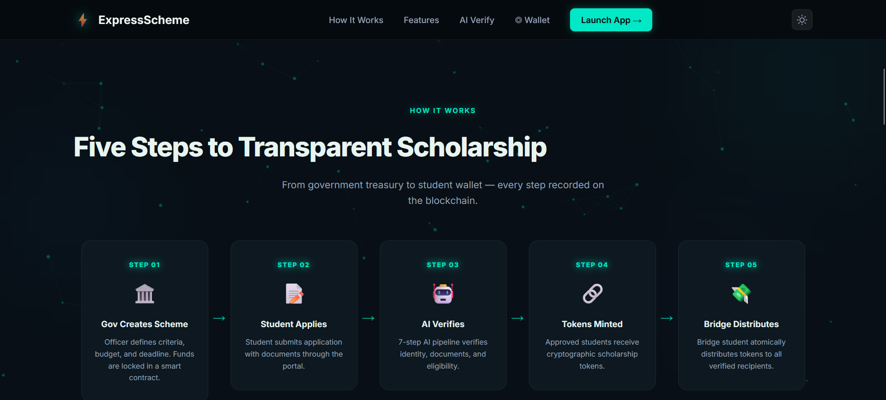
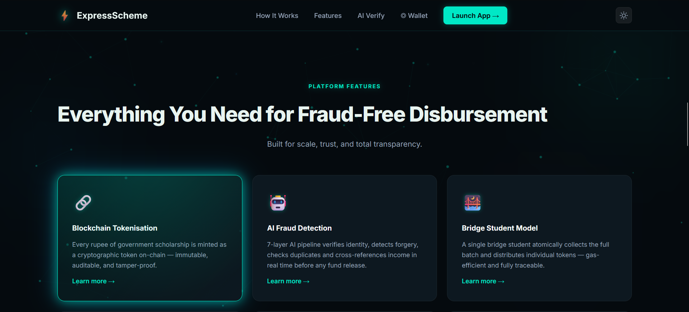
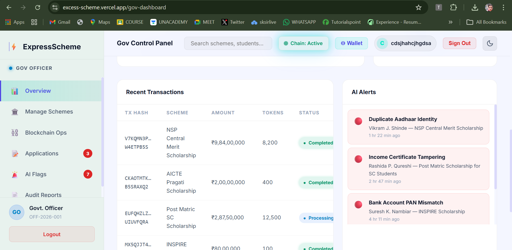
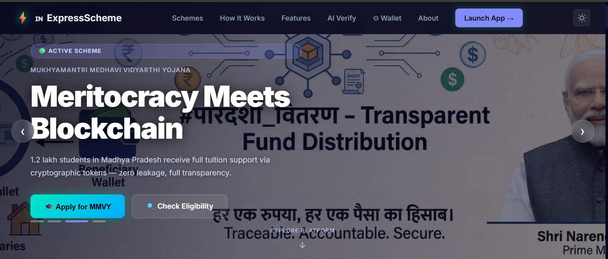

# 🚀 ExcessScheme - FundScheme  
### FINTECH ENABLED E-GOVERNANCE PORTAL  
**Idea :**  ExcessScheme is a decentralized mediator platform built on the Algorand blockchain that seamlessly connects government/organizations with citizens. Government departments, NGOs, and private organizations deposit funds (scholarships, subsidies, donations) which are converted into Algorand Standard Assets (ASA) – unique tokens for each scheme. Citizens register using Aadhaar/PAN verification, and their information is securely stored on the blockchain while maintaining privacy. Through smart contracts, payments are automatically distributed to citizens' wallets, making the entire process transparent, traceable, and tamper-proof. The platform also provides liquidity through tokenization (e.g., students can use scholarship tokens later). Additionally, our AI/ML monitoring system analyzes transaction patterns in real-time to detect and prevent money mule activities, ensuring funds reach the right beneficiaries and reducing fraud significantly.

**Team Name:** IMAGINARY_CODER  

---

## 📸 Screenshots

### 🖼️ Platform Banners

| Banner 1 | Banner 2 |
|:--------:|:--------:|
|  |  |

| Banner 3 | Banner 4 |
|:--------:|:--------:|
|  |  |

| Banner 5 | Banner 6 |
|:--------:|:--------:|
|  |  |

| Banner 7 | Banner 8 |
|:--------:|:--------:|
|  |  |

---

## 🌍 Overview

ExcessScheme is a decentralized mediator platform built on the **Algorand Blockchain** to tokenize, distribute, and track government schemes, scholarships, and NGO donations.

The platform eliminates corruption, reduces fund leakage, prevents ghost beneficiaries, and detects money mule fraud using AI/ML-driven blockchain analysis.

Instead of directly distributing fiat money, funds are converted into blockchain tokens and governed by smart contracts deployed using AlgoKit.

---

## ❗ Problem Statement

Traditional Scheme distribution systems suffer from:

- Fund leakage and corruption  
- Fake beneficiaries  
- Lack of transparency  
- Delayed manual verification  
- Money mule fraud  

Centralized systems lack accountability and real-time audit capability.

---

## 💡 Our Solution

ExcessScheme transforms welfare distribution into a programmable, transparent, and secure blockchain-based system.

### Core Concept:
1. Convert scheme funds into Algorand tokens.
2. Distribute tokens via smart contracts.
3. Track every transaction transparently.
4. Detect suspicious fund movement using AI/ML.

---

# 🏗️ Architecture

The platform operates in two primary layers:

---

## 🏛️ 1. Fund Provider Layer  
(Government / NGOs / Private Organizations)

### Step 1: Fund Deposit  
Organizations deposit scheme funds into the platform.

### Step 2: Tokenization  
Funds are converted into **Algorand Standard Assets (ASA)**.

Each scheme gets its own token:
- ScholarshipToken  
- DonationToken  
- ReliefToken  

### Step 3: Smart Contract Governance (AlgoKit)

Smart contracts define:

- Eligibility rules  
- Distribution logic  
- Vesting conditions  
- Redemption restrictions  
- Fraud triggers  

All logic is automated and tamper-proof.

---

### 🔹 Scholarship Tokenization API (Innovation Module)

A dedicated API module allows:

- Dynamic creation of new scheme tokens  
- Automatic smart contract configuration  
- Liquidity and redemption control  
- Secure scheme deployment  

This enables scalable welfare tokenization.

---

## 👩‍🎓 2. Beneficiary Layer  
(Schools / Students / Public Users)

### Identity Verification

Users register and verify using:

- Aadhaar  
- PAN  

After KYC verification, user identity metadata is securely linked to blockchain records.

Innovation for Government Side
Auto-Regulatory Smart Contracts

Self-executing contracts that adapt to changing regulations

Example: When government raises scholarship amount, smart contract automatically adjusts token values for ongoing schemes

Multi-Stakeholder Approval Workflow.
Predictive Fund Utilization AI

ML models predict which schemes will be underutilized

Recommends reallocation before funds expire

Proposed Solution for Citizens
1. Unified Digital Identity & Wallet
Citizens create account using Aadhaar/PAN with biometric/OTP verification

One wallet for all scheme benefits, donations, subsidies

Privacy-preserved – identity hashed on blockchain, actual data encrypted

Example: Farmer Ram Singh in UP has one wallet receiving PM-KISAN, fertilizer subsidy, and scholarship for his daughter – all in different tokens

2. Multi-Modal Access
Mobile app for smartphone users

USSD/SMS interface for feature phones

Biometric authentication at common service centers (CSC) for non-digital citizens

Example: Elderly woman without smartphone visits local panchayat office, verifies with fingerprint, receives pension tokens

3. Token Utilization Options
Redeem at partner merchants – tokens accepted by registered shops, hospitals, schools

Convert to fiat – withdraw at banking correspondents/ATMs

Transfer to family members – within verified family circle

Save/invest – token savings account with nominal interest

Example: Student uses scholarship tokens to pay college fees directly, no need to withdraw cash

4. Personal Dashboard
View all benefits received (scheme-wise total)

Track pending applications and approvals

Real-time notifications for new schemes they're eligible for

Example: Construction worker sees he's eligible for 3 different welfare schemes based on his profile – applies with one click

5. Consent-Based Data Sharing
Citizens control who can access their information

Share verified credentials with banks, employers, institutions without exposing raw data

Example: Student applying for education loan shares her scholarship history with bank via zero-knowledge proof – bank approves faster

Innovation for Citizen Side
Family-Clustered Wallets

Linked wallets for family members with configurable permissions

Parents can manage children's scholarship tokens

Example: Family of 5 has one master wallet, father can distribute monthly ration tokens to each member

Voice-Based Interface in Regional Languages

AI-powered voice assistant in 12 Indian languages

Illiterate users can check balance, transfer tokens using voice commands

Example: Tea estate worker in Assam checks her MGNREGA wages by speaking in Assamese

Predictive Eligibility Engine

ML analyzes citizen's profile and automatically suggests applicable schemes

Pre-filled application forms to reduce errors

Example: Young woman completing 10th grade gets notification: "You're eligible for 3 scholarships – apply now"

Token Marketplace

Peer-to-peer exchange of tokens with community members

Example: If someone needs extra ration tokens this month, they can borrow from neighbor's surplus and return later – all tracked transparently

Behavioral Incentive System

Bonus tokens for positive behaviors (vaccination, school attendance, women's health checkups)

Gamification to encourage scheme utilization

Example: Family gets 50 bonus tokens when all children are fully vaccinated – redeemable at local shops

Offline-First Architecture

QR code-based token transfer in areas with no internet

Syncs when connection available

Example: Village in remote Ladakh – shopkeeper scans citizen's offline QR, transaction recorded when phone gets network

---

### Token Distribution

Once approved:

- Tokens are transferred to beneficiary wallets  
- Transactions are recorded immutably on Algorand  
- Full transparency is maintained  

No manual interference.

---

# 🔍 AI-Based Money Mule Detection

Money mule fraud occurs when multiple beneficiaries redirect funds to a single suspicious wallet.

Because Algorand provides a transparent public ledger, our system:

- Builds transaction graphs  
- Detects abnormal clustering  
- Identifies repetitive fund redirection  
- Flags suspicious wallets  

If unusual patterns are detected:

- Tokens can be flagged  
- Wallet access can be restricted  
- Alerts are triggered for review  

This creates proactive fraud prevention.

---

# ⚙️ Tech Stack

- **Blockchain:** Algorand  
- **Smart Contracts:** AlgoKit  
- **Token Standard:** Algorand Standard Assets (ASA)  
- **Frontend:** React (Vite + React Router)  
- **Fraud Detection:** AI/ML Transaction Graph Analysis  

---

# 📁 Project Structure

ExcessScheme/
│
├── src/ # React source files
├── dist/ # Production build
├── css/ # Styles
├── js/ # JavaScript modules
├── node_modules/ # Dependencies
├── index.html # Entry point
├── package.json # Project metadata
├── package-lock.json
├── vite.config.js # Vite configuration
└── README.md

---

# ✨ Key Features

- Tokenized scheme & donation distribution  
- Identity-linked beneficiary wallets  
- Smart contract-based governance  
- Scholarship Tokenization API  
- Transparent blockchain tracking  
- AI-powered money mule detection  
- React-based modern UI  
- Day/Night theme toggle  

---

# 🔐 Why Algorand?

Algorand provides:

- Pure Proof of Stake (PPoS) consensus  
- Instant transaction finality  
- Low transaction fees  
- High scalability  
- Native asset tokenization (ASA)  

This makes it ideal for large-scale welfare infrastructure.

---

# 🌟 Innovation Impact

ExcessScheme converts:

Manual systems → Automated smart contracts  
Opaque transactions → Transparent blockchain records  
Reactive fraud detection → AI-driven prevention  

It builds trust through code, not intermediaries.

---

# 🚀 Future Scope

- DAO-based governance  
- Zero-knowledge identity integration  
- National-scale welfare deployment  
- Real-time audit dashboards  

---

# 👥 Team

**IMAGINARY_CODER**  
Hackathon Track: Open Innovation – Algorand  

---

## 📜 License

This project is developed for hackathon and educational purposes.
